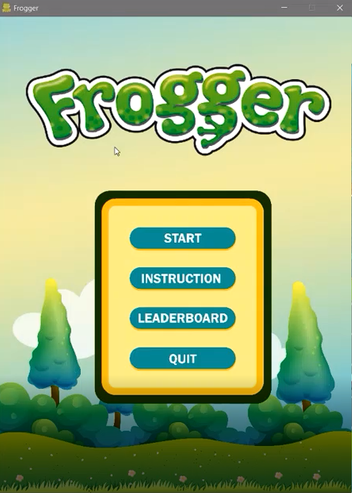

# Frogger Arcade  
  

	
	
<\p>

  
# Key Changes

### Maintenance  
 - Breaking Down Large Classes
	 - In the initial demo, the game project only consist of 12 classes in total and each classes is unclear and intertwined with each other. 
	 - For example, the Animal class that extends from Actor not only responsible for the frog that spawned on the map, but also responsible for catching the user's keycode such as, W,A,S,D.
	 - In the final demo, all classes have been further broken down into more specific classes to adhere the single-responsibility principle. 
	 - For example, the Frog class which is initially Animal class is no longer responsible for catching the user's keycode but only controlling the behavior of the frog that spawned on the map.
 - Update on Game GUI
	 - In the initial demo, the game is designed in retro vintage arcade theme
	 - Game artwork are all re-design in to a clearer graphics  and brighter theme to provide more user-friendly and cheerful atmosphere to the player.
 - Code Refactoring
	 - In the initial demo, code smell is detected in most of the classes and hence code refactoring is done.
	 - For example, the initial class of actor is detected to be brain class as all the objects spawned on map are extended from this class. Hence the object inherits multiple unused method or field.
	 - Code factoring is done by breaking down the Actor class into more specific classes and ensure that each instance that created will utilized all method and fields created. 
 - Implementation on Design Pattern
	 - Singleton
		 - This pattern is implemented in the game controller class as there is only required one instance of each controller throughout the game. It is achieved by making the controller constructor private and create a static creation method that acts as a constructor whereby it will invoke the private constructor to create an instance and save it in a static field. All following calls to this method return the cached controlled. 
	 - Factory
		 - This design pattern is implemented in the game level sub-package, whereby if controller ask for a new level when level switching, the level factory will construct and return a level object based on the request sent from the controller.
	 - Middleton
		 - Actors existing in the game doesn’t aware of the existence of each other. If something important happens within or to an actor, it must only notify the mediator. When the mediator receives the notification, it can easily identify the sender, which might be just enough to decide what actor should be triggered in return.
	 - MVC
		- When player pressed a key on keyboard, the view, which is the game pane will raised a flag of key pressed. The game controlled caught the flag and invoke the respective action by asking the actor frog to move. This series of actions adhere MVC pattern as the view and model doesn't know the existence of each other and only communicate thro the controller.
 
	

### Extension  
- Extend game from single-scene to multiple scene program
	- Initially the game is only implemented single scene which is the game scene.
	- In the final design, the game is extended into multiple scene program such as, start screen, leaderboard and instruction scene.
- Extend game from single level game to multiple level game
	- Initially the game only has 1 level for the player to play.
	- In the final design, the game is extended to 10 different level with different design. As the levels increases, player might encounter new threats or bonus for them to gain more point.  
- Extend the variety of actors that spawned on the map 
	- Initially, the game only 5 different kind of actors that will be spawned on the map.
	- In the final design, the actors is further extended into 10 different kind of actors, each with unique behavior. 

